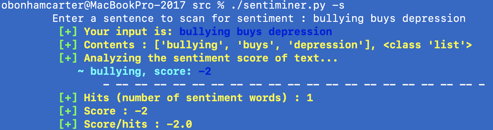

##### Sentiminer
##### Date: 16 March 2022
##### Oliver Bonham-Carter, [Allegheny College](https://allegheny.edu/)
##### email: obonhamcarter@allegheny.edu

---


[](https://opensource.org/licenses/MIT)

[](https://blacklivesmatter.com/)

GitHub link: https://github.com/developmentAC/xxx

### Table of contents
* [Overview](#overview)
* [Mechanism](#mechanism)
* [Commands](#commands)
* [Output](#output)
* [References](#references)
* [A Work in Progress](#a_work_in_progress)


### Overview
Sentiment analysis is the semantic study of emotion in language. This form of analysis is used to determine the level of satisfaction or dissatisfaction in textual data such as reviews,  survey responses, online and social media posting and similar. Due to the often high volume of feedback for from the above types of textual data, sentiment analysis provides an automated solution for determining the "feel" of the text.


This program performs sentiment analysis on textual data using the AFinn (from Finn Årup Nielsen) sentiment analysis method. The accompanying AFinn data file with this project was isolated from the R programming open source project Tidyverse (See reference below).

Each word that able to convey a sensation of optimism or pessimism in the English language has been paired with a curated numerical value called the _sentiment score_. The scale of __pessimism__ to __optimism__ ranges from -5 to 5. An short example of some of the words of the AFinn dictionary is given below.

```
Word,Score
abandon,-2
abandons,-2
abandoned,-2
absentee,-1
absentees,-1
aboard,1
abducted,-2
abduction,-2
abductions,-2
```


### Mechanism
Sentiminer isolates each word of the the user-inputted text to determine the sentiment score of each word. Shown below, the summation of all scores is found for the body of text, and is then divided by the total number of hits (i.e., found words) which having a score of pessimism or optimism.

_summation_ = score(word_1) + ... score(word_n)

_sentiment score of the text_ = (_summation_ / _n_)

We note that the _score_ value is the measurement of the sentiment in the text sample.

### Commands

Sentiminer has been written in Python (ver3) and can be run with the commands shown below. The inputs may be a text file, or the user can be prompted to write a sentence. In both cases, the analysis is the same.

To be prompted for a sentence from the user:
```
python3 sentiminer.py -S
```

To enter a text file, the following command maybe used.  
```
python3 sentiminer.py textFile.txt
```

### Output

For the sentence, `share the load, share the love`, the resulting score is 1.67 which is calculated from three words as shown in the figure of the output below. The score is positive to suggest that the text is generally optimistic.


For the sentence, `bullying buy depression`, the resulting score is -2 which is calculated from the word, "bullying" as shown in the figure of the output below. The score is negative to suggest that the text is generally pessimistic.




### References

 Wickham H, Averick M, Bryan J, Chang W, McGowan LD, François R, Grolemund G, Hayes A, Henry L, Hester J, Kuhn M, Pedersen TL, Miller E, Bache SM, Müller K, Ooms J, Robinson D, Seidel DP, Spinu V, Takahashi K, Vaughan D, Wilke C, Woo K, Yutani H (2019). “Welcome to the tidyverse.” Journal of Open Source Software, 4(43), 1686. doi: 10.21105/joss.01686.)


### A Work in Progress

Check back often to see the evolution of this project!! Sentiminer is a work-in-progress and updates are likely to come.

If you would like to contribute to this project, __then please do!__ For instance, if you see some low-hanging fruit or task that you could easily complete, that could add value to the project, then I would love to have your insight.

Otherwise, please create an Issue for bugs or errors. Since I am a teaching faculty member at Allegheny College, I may not have all the time necessary to quickly fix the bugs and so I would be very happy to have any help that I can get from the OpenSource community for any technological insight. Much thanks in advance.

If you appreciate this project, please consider clicking the project's _Star_ button.
:-)
